# Laza Shop - Firebase Integration (Mini Project)

A production-ready Flutter e-commerce application demonstrating the integration of Firebase Authentication and Cloud Firestore. This project is a continuation of the Laza Shop UI, now upgraded with a real backend.

## 🚀 Features

### Phase 1: Firebase Authentication
* **Sign Up Screen:** Allows users to create a new account using Email and Password. Form includes robust validation.
* **Login Screen:** Existing users can sign in using their Email and Password.
* Smooth animated transitions between authentication screens and the Home screen.

### Phase 2: Cloud Firestore (Save & Display Data)
* **Complete Profile Form:** A dedicated screen where authenticated users can add a new profile record (Name, Age, and Favourite Hobby).
* **Real-time Display:** A separate screen that fetches and displays all saved profile records from Firestore in real-time using `StreamBuilder`.

## 📸 Screenshots

|   |   |   |
| :---: | :---: | :---: |
| 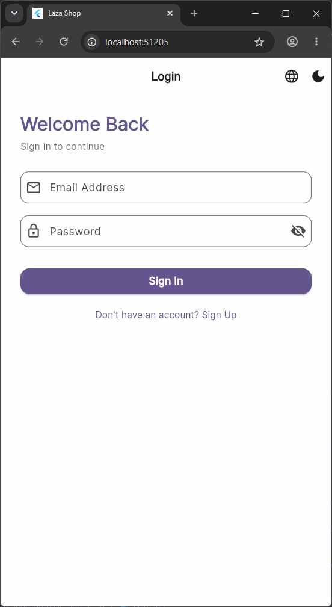 | 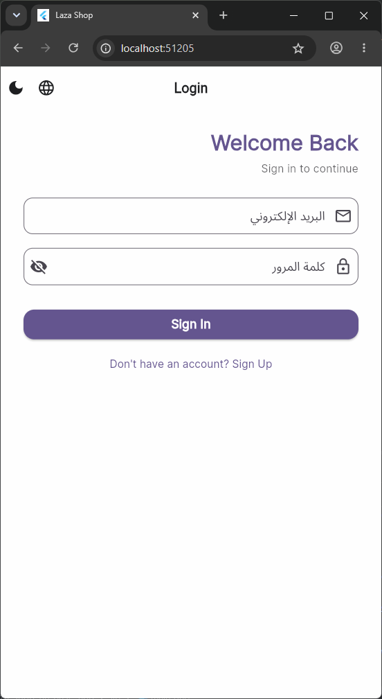 | 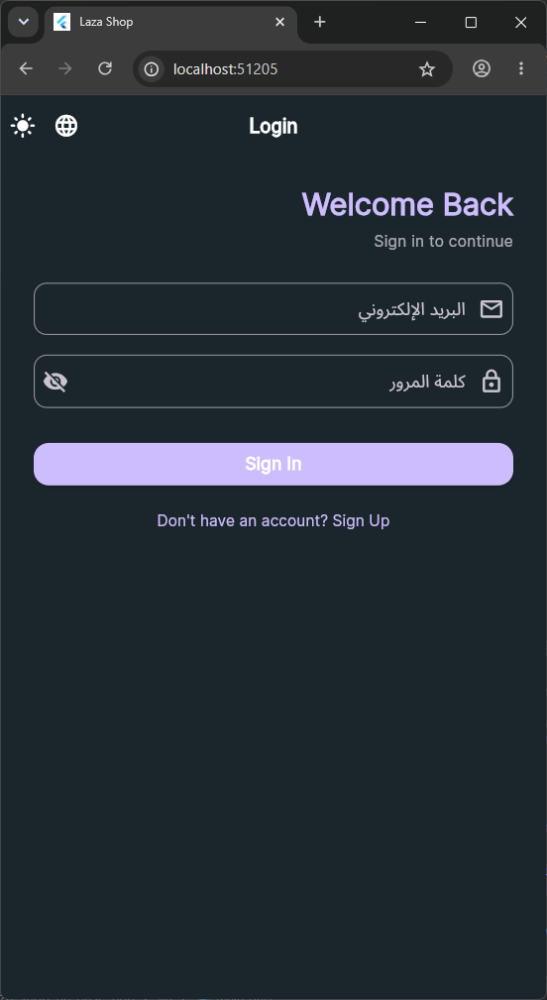 |
| 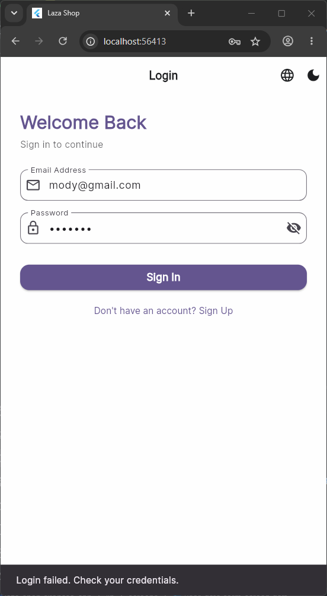 | 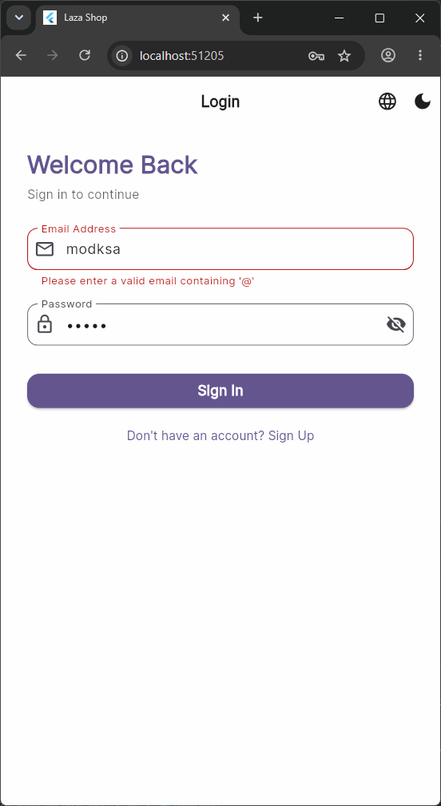 | 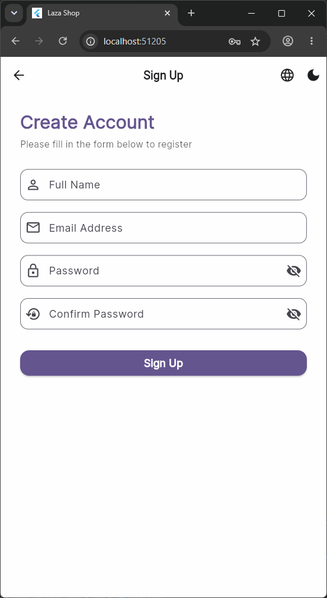 |
| 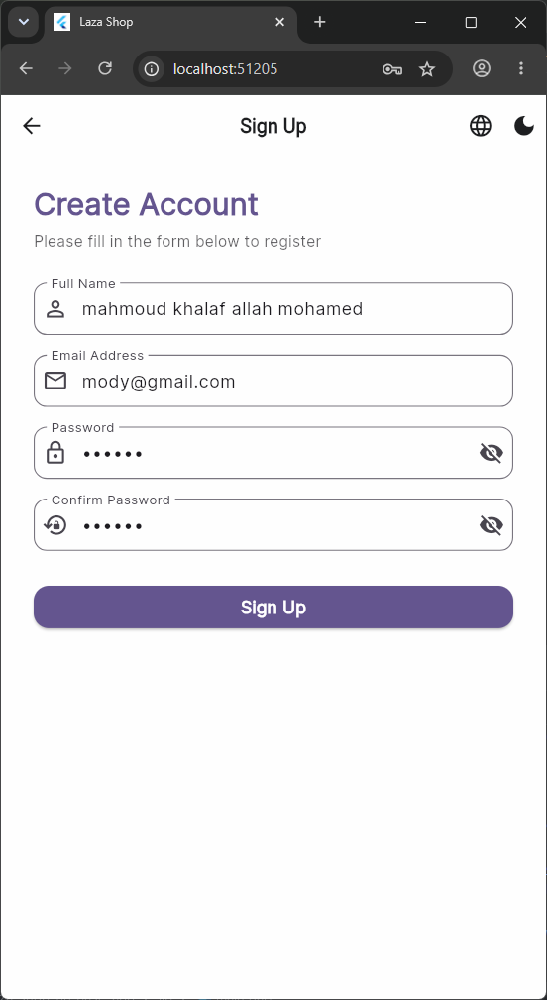 | 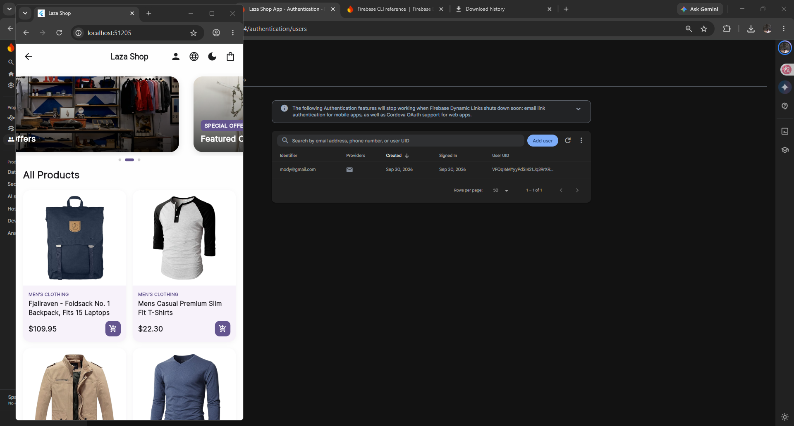 | 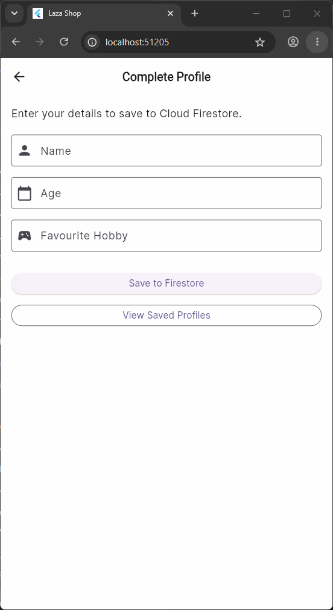 |
| 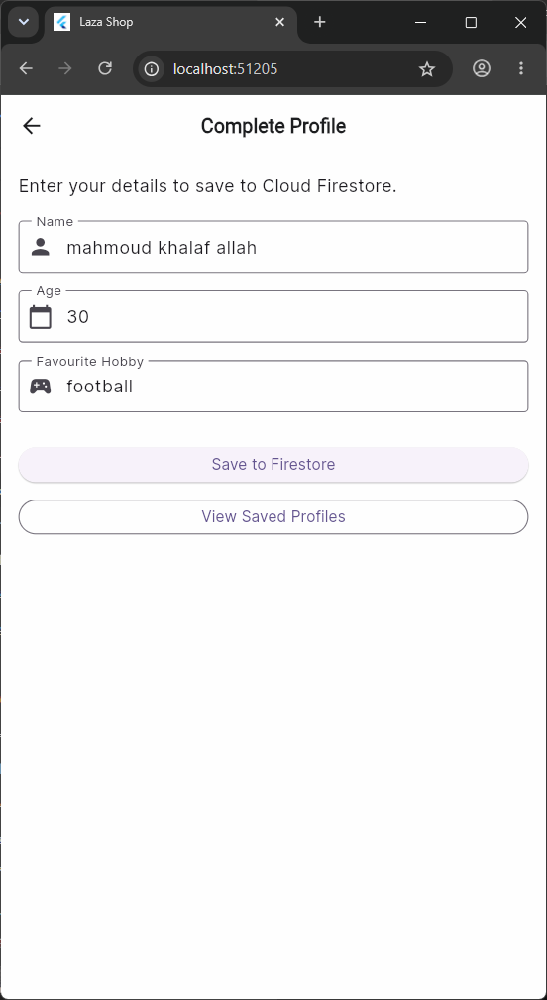 | 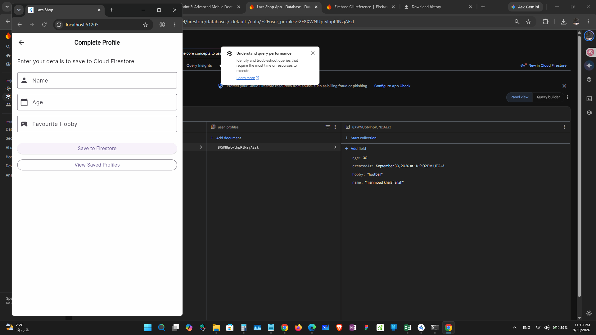 | 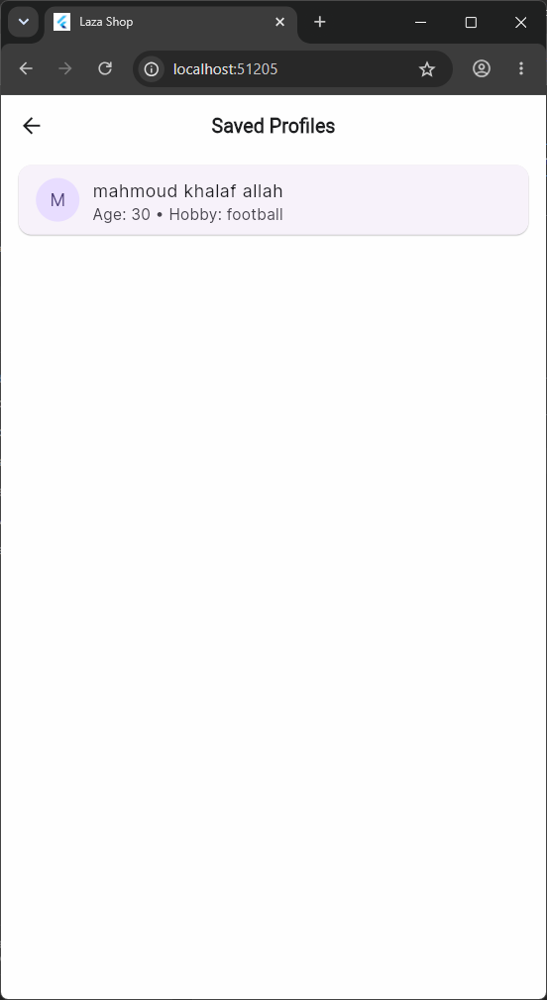 |
| 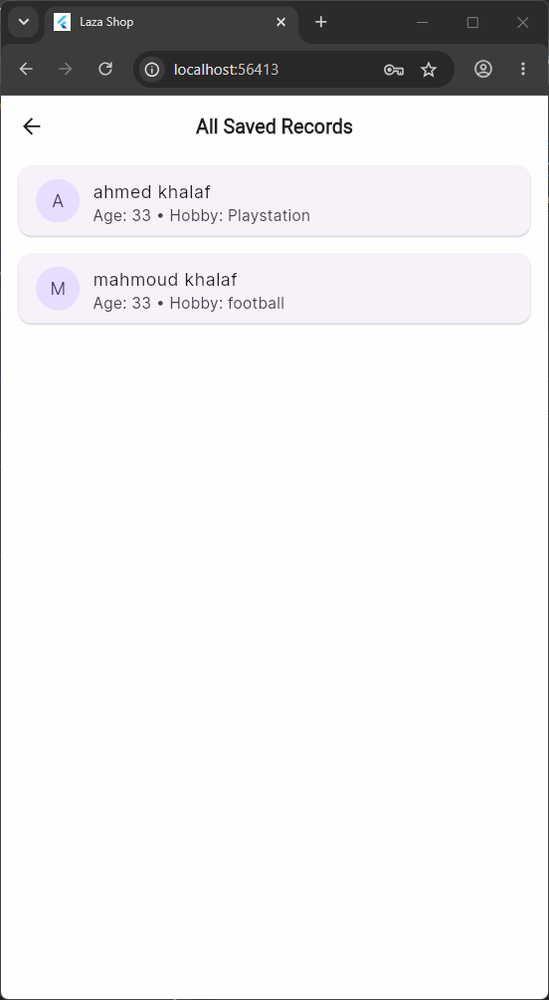 | | |

## 🛠️ Technologies & Packages
* **Flutter SDK & Dart**
* **Firebase Core:** `firebase_core`
* **Firebase Authentication:** `firebase_auth`
* **Cloud Firestore:** `cloud_firestore`
* **State Management:** `flutter_bloc`
* **Network/API:** `dio`

## ⚙️ Getting Started

1. Clone the repository:
   ```bash
   git clone https://github.com/mahmoudkhalaf93/laza_shop_firebase_app.git
   ```
2. Navigate to the project directory:
   ```bash
   cd laza_shop_firebase_app
   ```
3. Get Flutter dependencies:
   ```bash
   flutter pub get
   ```
4. Configure Firebase:
   Run the FlutterFire CLI command to link this project with your Firebase account (Ensure Firebase Auth and Firestore are enabled in your console):
   ```bash
   flutterfire configure
   ```
5. Run the app:
   ```bash
   flutter run
   ```

## 📝 Notes
* Firestore rules should be configured to allow reading and writing for the features to work properly.
* Code is organized cleanly with separate files for screens and services. 
